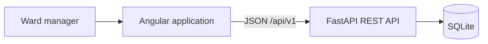
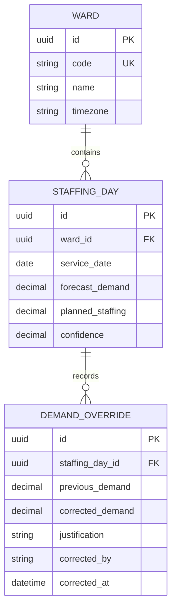

# DaphOS Staffing Forecast Cockpit — Architecture

## 1. Goal and scope

The application lets a ward manager review and correct staffing demand forecasts one calendar week at a time.

The required scope is:

- display all wards for the selected week;
- display forecast demand, effective demand, planned staffing, and confidence for every day;
- navigate between weeks;
- distinguish understaffing from forecast uncertainty;
- correct demand for today or a future day;
- reject negative values and require justification for significant deviations;
- preserve who changed what, when, and why;
- display a weekly summary for every ward;
- persist deterministic seed data in SQLite for at least four weeks, including a past week.

Authentication, forecast generation, realtime updates, and production infrastructure are outside the challenge scope.

## 2. Technology stack

- **Frontend:** Angular, strict TypeScript, standalone components, Signals, typed Reactive Forms.
- **UI:** Angular Material for accessible controls and Tailwind CSS for layout and status presentation.
- **Backend:** Python, FastAPI, Pydantic, SQLAlchemy, Alembic.
- **Database:** SQLite.
- **Frontend tests:** Jest and Angular Testing Library.
- **Backend tests:** pytest.
- **End-to-end tests:** Selenium WebDriver, TypeScript, and Jest.

The repository contains `frontend/` and `backend/` folders. No monorepo framework is required.

## 3. System design



The frontend repeats simple validation for immediate feedback. The backend remains authoritative for all business rules and calculated summaries.

## 4. Domain model



### Staffing day

The original forecast remains immutable. Effective demand is the latest corrected value or the original forecast:

```text
effectiveDemand = latest correctedDemand ?? forecastDemand
understaffing = max(effectiveDemand - plannedStaffing, 0)
```

Constraints:

- forecast demand and planned staffing are non-negative;
- confidence is between `0` and `1`;
- `(wardId, serviceDate)` is unique.

### Demand override and audit history

Every correction creates an append-only `DemandOverride`. Existing history records are never edited or deleted through the API.

The backend assigns:

- `correctedBy = "demo.ward.manager@daphos.test"`;
- `correctedAt` as a UTC timestamp;
- `previousDemand` from the current effective demand.

The correction is rejected when:

- the ward-local service date is in the past;
- corrected demand is negative;
- corrected demand has more than two decimal places;
- justification is missing for an absolute deviation of at least `2.00` FTE or a relative deviation of at least `20%`.

If forecast demand is zero, every non-zero correction requires justification.

### Weekly summary

For each ward:

- `totalUnderstaffing`: sum of `max(effectiveDemand - plannedStaffing, 0)` across the selected week;
- `manualCorrectionCount`: number of override audit events for dates in the selected week;
- `averageAbsoluteDeviation`: average `abs(effectiveDemand - forecastDemand)` across days with at least one correction.

`averageAbsoluteDeviation` is `null` when no days were corrected. Absolute deviation is used so upward and downward corrections do not cancel each other.

## 5. REST API

Conventions:

- prefix `/api/v1`;
- JSON properties use `camelCase`;
- dates use `YYYY-MM-DD`;
- timestamps use ISO 8601 UTC;
- a week starts on Monday;
- ORM models are not exposed directly.

### Get a staffing week

```http
GET /api/v1/staffing-weeks?weekStart=2026-09-14
```

One response returns all wards and seven ordered days, avoiding one browser request per ward.

```json
{
  "weekStart": "2026-09-14",
  "weekEnd": "2026-09-20",
  "today": "2026-09-14",
  "overridePolicy": {
    "absoluteJustificationThreshold": 2,
    "relativeJustificationThreshold": 0.2
  },
  "wards": [
    {
      "id": "f6cd394c-20b5-4fab-a0ca-71099cbf50b1",
      "code": "B3",
      "name": "Ward B3",
      "days": [
        {
          "date": "2026-09-14",
          "forecastDemand": 12,
          "effectiveDemand": 14,
          "plannedStaffing": 11,
          "confidence": 0.58,
          "isCorrected": true,
          "canOverride": true,
          "understaffing": 3
        }
      ],
      "summary": {
        "totalUnderstaffing": 5.5,
        "manualCorrectionCount": 1,
        "averageAbsoluteDeviation": 2
      }
    }
  ]
}
```

The API returns `today` and `canOverride` so browser timezone differences cannot enable an invalid correction.

### Create a demand override

```http
POST /api/v1/wards/{wardId}/staffing-days/{date}/overrides
```

```json
{
  "correctedDemand": 14,
  "justification": "Two additional high-acuity admissions expected"
}
```

The response is `201 Created` and contains:

- the created audit record;
- the updated staffing day;
- the updated weekly summary for the ward.

This lets the frontend update the view without reloading the entire week.

### Get correction history

```http
GET /api/v1/wards/{wardId}/staffing-days/{date}/overrides
```

Returns all audit records for the selected day in descending correction time.

### Errors

- `400`: malformed date or week start;
- `404`: ward or staffing day does not exist;
- `422`: domain validation failure;
- `500`: unexpected failure without exposing internal details.

Validation errors include field-level messages that the Angular form can display.

## 6. Backend structure

```text
backend/
├── app/
│   ├── api/
│   │   ├── errors.py
│   │   └── staffing.py
│   ├── domain/
│   │   ├── policies.py
│   │   └── summaries.py
│   ├── persistence/
│   │   ├── database.py
│   │   ├── models.py
│   │   └── repositories.py
│   ├── schemas/
│   │   └── staffing.py
│   ├── services/
│   │   └── staffing_service.py
│   ├── main.py
│   └── seed.py
├── migrations/
└── tests/
```

- The router handles HTTP concerns only.
- Pydantic schemas validate transport data.
- The service coordinates validation and the database transaction.
- Pure domain functions implement correction policies and summaries.
- Repositories contain SQLAlchemy queries.
- Time-dependent policies receive the current time as an argument for deterministic tests.

This preserves clear responsibilities without adding command buses, CQRS, or unnecessary interfaces.

## 7. Frontend structure

```text
frontend/src/app/
├── core/
│   └── api/
│       ├── api.models.ts
│       └── staffing-api.service.ts
├── features/
│   └── staffing-forecast/
│       ├── components/
│       │   ├── override-dialog/
│       │   ├── override-history-dialog/
│       │   ├── staffing-day-cell/
│       │   ├── ward-week-grid/
│       │   ├── ward-week-summary/
│       │   └── week-navigation/
│       ├── pages/
│       │   └── forecast-cockpit-page/
│       ├── staffing.models.ts
│       ├── staffing.validators.ts
│       └── staffing-week.store.ts
├── app.config.ts
└── app.routes.ts
```

### State

A feature-scoped service stores:

- selected week;
- weekly data;
- loading state;
- error state.

It exposes readonly Signals and uses `HttpClient` for API requests. The selected week is synchronized with the `?week=YYYY-MM-DD` query parameter. NgRx is unnecessary for one feature.

### Components

- `ForecastCockpitPage` connects route state and the feature store.
- `WeekNavigation` changes the selected week.
- `WardWeekGrid` displays wards and seven days.
- `StaffingDayCell` displays demand, staffing gap, confidence, and correction state.
- `OverrideDialog` owns the typed correction form.
- `OverrideHistoryDialog` shows who changed what, when, and why.
- `WardWeekSummary` displays the required summary metrics.

Components are standalone, use `OnPush`, have strict inputs and outputs, and contain no HTTP calls or domain calculations.

### Material and Tailwind

- Angular Material provides dialogs, form controls, buttons, icons, tooltips, and focus management.
- Tailwind provides grid layout, spacing, responsive behavior, and status styling.
- Material internal CSS classes are not overridden.

## 8. Uncertainty and understaffing UX

Confidence and staffing gap are independent signals.

Each day cell displays:

1. effective demand;
2. original forecast when corrected;
3. planned staffing;
4. `Short N`, `Balanced`, or `Surplus N`;
5. confidence percentage and `Low`, `Medium`, or `High`;
6. a corrected indicator and history action.

Confidence bands:

- Low: below `60%`;
- Medium: `60–79%`;
- High: `80%` and above.

Understaffing uses a warning icon, contrasting surface, and text. Confidence uses a percentage, label, and separate marker. Color is never the only status indicator.

Past days remain visible but cannot be edited. The UI provides loading, error, and empty states. Dialogs support keyboard navigation and restore focus after closing.

## 9. Seed data

Seed dates are generated relative to the current ISO week:

- one past week;
- the current week;
- three future weeks.

The generator uses a fixed random seed for reproducible values and creates:

- at least three wards;
- understaffed, balanced, and surplus days;
- low, medium, and high confidence values;
- at least one existing correction with audit history.

Seeding is idempotent. The README states that forecast values are synthetic and no trained model is used.

## 10. Testing strategy

Every feature is completed as a tested vertical slice:

1. implement the smallest backend and frontend behavior;
2. add or update unit and integration tests;
3. add or update its Selenium user journey when the behavior is observable through the UI;
4. run focused tests for the changed feature;
5. run the complete relevant suites before moving to the next feature.

A feature is not complete while its tests are missing or failing.

### Coverage policy

The target is `80%` statement, branch, function, and line coverage for handwritten executable application and domain code.

Coverage excludes code where the metric provides little useful information:

- Angular and FastAPI bootstrap;
- type-only declarations and API interfaces;
- generated files;
- Alembic migrations;
- static configuration;
- test helpers and E2E page objects;
- defensive platform branches that cannot be triggered meaningfully in the application.

Every exclusion must be explicit and justified. Code must not be excluded merely to satisfy the threshold. Coverage is a safety net, while assertions must still verify meaningful behavior.

### Frontend unit and component tests

Use Jest for the runner, mocks, coverage, and assertions. Chai is not added because Jest already provides a complete `expect` API; combining both would create inconsistent test conventions.

Cover:

- correction policy boundaries, including `2.00`, `20%`, zero forecast, and negative values;
- confidence-band and staffing-status calculations;
- day-cell rendering for deficit, uncertainty, and corrected values;
- typed form validation and server field errors;
- feature-store loading, errors, week changes, and successful corrections;
- loading, error, and empty states;
- week navigation and query-parameter synchronization;
- history and weekly-summary presentation.

Use Angular Testing Library for behavior-oriented component tests and `HttpTestingController` at the API boundary.

### Backend unit and integration tests

Use pytest with a fixed clock and a temporary SQLite file.

Cover:

- policy boundaries and ward-local past-date validation;
- summary calculations, including no corrections and repeated corrections;
- weekly endpoint validation, ordering, and derived values;
- valid and invalid override creation;
- append-only history;
- server-assigned user and UTC timestamp;
- persistence across requests;
- API error mappings and field-level messages.

### Selenium feature tests

Use:

- `selenium-webdriver`;
- TypeScript;
- Jest;
- headless Chrome.

Maintain a small number of feature-oriented E2E scenarios:

1. Browse previous and future weeks and verify the URL and visible data.
2. Recognize understaffing and low confidence as independent indicators.
3. Reject an invalid correction, save a valid correction, verify the updated summary and audit history, then reload and verify persistence.
4. Verify that a past day cannot be corrected.

Rules:

- never use fixed sleeps;
- wait for observable UI conditions;
- prefer accessible selectors and use `data-testid` only when necessary;
- reset the database to a deterministic seed before each scenario;
- capture a screenshot and browser logs on failure;
- keep page objects shallow and composition-based.

E2E tests verify integration and user behavior but are not counted toward frontend unit coverage.

## 11. Code rules

- All source code, UI text, tests, documentation, and comments are in English.
- Comments explain only non-obvious decisions or constraints.
- TypeScript uses strict mode and no `any`.
- Python code has type annotations.
- Business logic does not live in Angular templates or FastAPI routers.
- The backend is authoritative for validation and summaries.
- Composition is preferred over inheritance.
- No abstraction is added without a concrete use in this challenge.
- ESLint, Prettier, Ruff, and mypy enforce consistent code.

## 12. Feature-by-feature implementation order

### Step 1 — Scaffold

- Create `frontend/` and `backend/`.
- Enable strict Angular checks.
- Configure FastAPI, SQLAlchemy, and SQLite.
- Configure Jest/coverage for frontend and pytest/coverage for backend.
- Create the Selenium TypeScript test project and shared driver lifecycle.
- Add a root README with native startup commands.

Exit condition: both applications start, test runners execute, coverage reports are generated, and Selenium opens the application.

### Step 2 — Database and seed

- Create `Ward`, `StaffingDay`, and `DemandOverride` tables.
- Add the initial Alembic migration.
- Generate five weeks relative to the current week.
- Make seeding deterministic and idempotent.
- Add backend tests for constraints and deterministic seeding.

Exit condition: restarting the backend preserves the same dataset and the backend coverage gate passes.

### Step 3 — Weekly read API

- Implement summary calculations.
- Implement `GET /api/v1/staffing-weeks`.
- Validate that `weekStart` is a Monday.
- Return all wards and seven ordered days.
- Add unit tests for summaries and API integration tests for the weekly response.

Exit condition: one API request returns all data required by the cockpit and the backend has full covered behavior.

### Step 4 — Weekly Angular cockpit

- Implement week navigation and URL query state.
- Add the feature store and API service.
- Render wards and seven days.
- Add loading, error, and empty states.
- Add Jest tests for the API service, store, navigation, and page states.
- Add the Selenium week-navigation scenario.

Exit condition: the user can browse all seeded weeks and the focused Jest and Selenium scenarios pass.

### Step 5 — Risk visualization

- Display effective demand and planned staffing.
- Add `Short`, `Balanced`, and `Surplus`.
- Add numeric confidence and confidence bands.
- Ensure status is understandable without color.
- Add Jest tests for calculations and component rendering.
- Add the Selenium risk-visibility scenario.

Exit condition: understaffing and uncertainty are recognizable at a glance and covered at unit, component, and feature levels.

### Step 6 — Override backend

- Implement correction policy functions.
- Implement transactional override creation.
- Assign audit user and timestamp on the backend.
- Return the updated day and ward summary.
- Implement the history endpoint.
- Add policy, service, persistence, and API tests.

Exit condition: valid corrections persist, invalid corrections return field-level errors, and backend coverage remains complete.

### Step 7 — Override and history UI

- Create the typed correction form.
- Repeat correction policy for immediate feedback.
- Display backend validation messages.
- Update the day and summary after saving.
- Add the history dialog.
- Disable correction for past days.
- Add Jest tests for the form, store update, summary, and history.
- Add Selenium correction, persistence, and past-day scenarios.

Exit condition: the complete correction and traceability flow works after page reload, all focused tests pass, and frontend coverage remains complete.

### Step 8 — Full verification

- Run all frontend Jest tests with all coverage thresholds.
- Run all backend pytest tests with all coverage thresholds.
- Reset the seed and run the complete Selenium feature suite.
- Run linting, formatting checks, strict TypeScript checks, and mypy.

Exit condition: all checks pass from a clean checkout with no unjustified coverage exclusions.

### Step 9 — Submission documentation

- Document native setup and test commands.
- Explain where seed data comes from.
- Include the brief architecture summary below.
- Record unfinished work honestly.

Exit condition: a reviewer can run and understand the project without additional instructions.

## 13. Brief architecture summary for submission

`Ward` owns daily staffing records. `StaffingDay` preserves the generated forecast, planned staffing, and confidence. Each manual correction creates an append-only `DemandOverride` with previous and corrected demand, justification, server-assigned user, and UTC timestamp. Effective demand comes from the latest override, which preserves the original forecast and provides a complete audit trail.

The FastAPI backend exposes one weekly endpoint that returns all wards and seven days, avoiding N+1 browser requests. It calculates effective demand and ward summaries so every client uses the same rules. Creating an override is a separate endpoint, and the backend rejects past dates, negative values, and significant deviations without justification.

The Angular frontend uses standalone components, typed Reactive Forms, and a small Signals-based feature store. Angular Material provides dialogs, form fields, toolbar, cards, and lists, while Tailwind handles layout spacing for the weekly grid. Understaffing and confidence remain independent: staffing is shown as `Short`, `Balanced`, or `Surplus`, while confidence is shown as a percentage and Low/Medium/High label. Text and icons accompany color.

Jest provides full coverage of handwritten frontend behavior, while pytest fully covers backend domain and application behavior. Selenium WebDriver scenarios written in TypeScript and run with Jest verify week browsing, risk visualization, correction validation, audit history, and persistence in the real application. Chai is not used because Jest supplies the project-wide assertion API. With more time, the project could add mutation testing, Docker startup, multi-browser execution, optimistic concurrency, authentication, and PostgreSQL.
